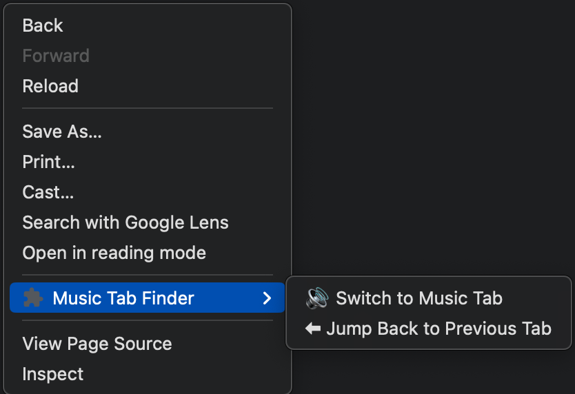

# 🎵 Music Tab Finder - Chrome Extension

**Easily find and switch to the tab playing audio with a keyboard shortcut or right-click menu!**  
This extension helps you quickly locate and switch to the tab that's playing music or any other sound.

## 🚀 Features
- 🎵 **Detects which tab is playing audio** automatically.
- 👝 **Right-click menu option** to switch to the audio tab easily.
- 🔄 Works on **YouTube, Spotify, SoundCloud, and any website** that plays sound.
- 🛠 **Lightweight & fast** - runs in the background without affecting performance.

---

## 👥 Installation

### 1️⃣ **Manual Installation (Unpacked)**
If you want to install the extension manually:

1. **Download the ZIP file** or clone the repository:
   ```sh
   git clone https://github.com/YOUR_USERNAME/music-tab-finder.git
   ```
2. Open **Google Chrome** and go to:
   ```
   chrome://extensions/
   ```
3. Enable **Developer Mode** (top-right corner).
4. Click **Load unpacked** and select the folder where you downloaded/cloned this repo.
5. The extension is now installed! 🎉

### 2️⃣ **Chrome Web Store (Coming Soon!)**
Once published, you can install it directly from the **Chrome Web Store**.

---

## 🎯 How to Use


1. **Right-click** anywhere in Chrome.
2. Click **🎧 "Switch to Music Tab"**.
3. Chrome will switch to the audio-playing tab.

---

## 🎼 Screenshots


---

## 🛠 Development & Contribution

Want to improve this extension? Feel free to contribute!  

### 🛠 **Setup for Development**
1. Clone this repo:
   ```sh
   git clone https://github.com/YOUR_USERNAME/music-tab-finder.git
   ```
2. Open **chrome://extensions/**
3. Enable **Developer Mode**
4. Click **Load Unpacked** and select the project folder.
5. Make changes, test, and submit a PR! 🚀

### ✅ **To-Do List / Future Improvements**
- [ ] Add support for **multiple audio tabs**.
- [ ] Improve **visual indicators** when switching tabs.
- [ ] Add **customizable keyboard shortcuts**.
- [ ] Publish to **Chrome Web Store**.

---

## 🤝 Contributing
Contributions are welcome! If you want to improve this extension:
1. **Fork the repository** 🍔
2. **Create a new branch** 🔀
3. **Commit your changes** 💾
4. **Submit a Pull Request** 🚀

---

## 📄 License
This project is licensed under the **MIT License**. You are free to use, modify, and distribute it.

---

## ⭐ Support & Feedback
If you like this project, consider **starring ⭐ the repository**!  
For any issues or feedback, open an **issue** in the GitHub repository.

---

**Happy Coding! 🎵🚀**

